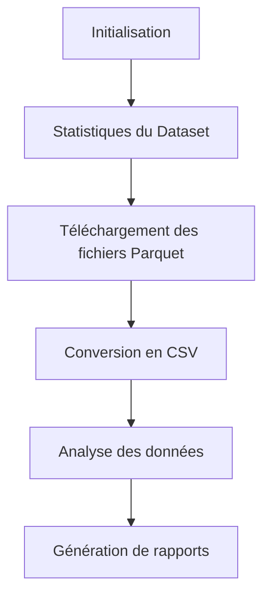

# Projet Darija App

## 📋 Vue d'ensemble

Ce projet est dédié à l'analyse et au traitement du dataset "Darija-SFT-Mixture", un ensemble de données linguistiques en dialecte marocain (Darija). Le projet comprend des outils pour télécharger, convertir et analyser ces données, avec une architecture modulaire et bien organisée.

## 🗂️ Structure du Projet

```
darija_app/
├── notebooks/                      # Notebooks d'analyse
│   ├── analyse_darija.ipynb        # Analyse détaillée des données
│   ├── cleaned_translations.json   # Traductions nettoyées
│   ├── structured_translations.json # Traductions structurées
│   └── invalid_translations.json   # Traductions invalides
│
├── data_Darija-SFT-Mixture/        # Dossier principal des données
│   ├── notebooks/                  # Notebooks supplémentaires
│   │
│   ├── tests/                      # Tests unitaires et d'intégration
│   │
│   ├── darija_modules/             # Modules Python du projet
│   │   ├── __init__.py             # Initialisation du package
│   │   ├── dataset_statistics.py   # Module d'analyse statistique
│   │   ├── parquet_downloader.py   # Module de téléchargement
│   │   └── pipeline_automatisation.py # Orchestration du pipeline
│   │
│   ├── darija_data/                # Données du projet
│   │   ├── parquet_files/          # Fichiers Parquet bruts
│   │   ├── csv_files/              # Fichiers CSV convertis
│   │   ├── execution_logs/         # Journaux d'exécution
│   │   └── dataset_statistics/     # Statistiques du dataset
│   │
│   ├── project_dependencies.txt    # Dépendances du projet
│   └── huggingface_token.env       # Configuration des tokens
│
├── venv/                           # Environnement virtuel Python
└── suivi.txt                       # Journal des modifications
```

## 🔍 Description des Composants

### 1. Modules Python (`darija_modules/`)

#### `dataset_statistics.py`
- **Fonction** : Récupère et analyse les statistiques du dataset via l'API Hugging Face
- **Classe principale** : `DarijaStatsAPI`
- **Fonctionnalités** :
  - Récupération des métadonnées du dataset
  - Génération de statistiques détaillées
  - Création de rapports en format Markdown
  - Sauvegarde des résultats en JSON

#### `parquet_downloader.py`
- **Fonction** : Télécharge les fichiers Parquet et les convertit en CSV
- **Classe principale** : `DarijaParquetDownloader`
- **Fonctionnalités** :
  - Téléchargement des fichiers via l'API Hugging Face
  - Conversion automatique de Parquet vers CSV
  - Gestion optimisée de l'espace disque

#### `pipeline_automatisation.py`
- **Fonction** : Orchestre l'exécution des différents modules
- **Classe principale** : `DarijaPipeline`
- **Fonctionnalités** :
  - Configuration de l'environnement d'exécution
  - Exécution séquentielle des modules
  - Gestion des erreurs et des dépendances
  - Mesure des performances

### 2. Données (`darija_data/`)

#### `parquet_files/`
- Stockage temporaire des fichiers Parquet téléchargés
- Ces fichiers sont supprimés après conversion en CSV

#### `csv_files/`
- Fichiers CSV convertis à partir des fichiers Parquet
- Format plus accessible pour l'analyse

#### `execution_logs/`
- Journaux détaillés de l'exécution du pipeline
- Suivi des erreurs et des performances

#### `dataset_statistics/`
- Statistiques du dataset au format JSON
- Rapports d'analyse au format Markdown

### 3. Notebooks d'analyse (`notebooks/`)

#### `analyse_darija.ipynb`
- Analyse approfondie des données Darija
- Visualisations et statistiques détaillées
- Traitement et nettoyage des traductions

#### Fichiers JSON
- `cleaned_translations.json` : Traductions nettoyées
- `structured_translations.json` : Traductions structurées
- `invalid_translations.json` : Traductions invalides identifiées

## 🚀 Fonctionnement du Pipeline

Le pipeline complet s'exécute dans l'ordre suivant :

1. **Initialisation** : Configuration des dossiers et du système de logs
2. **Statistiques** : Récupération et analyse des métadonnées du dataset
3. **Téléchargement** : Obtention des fichiers Parquet depuis Hugging Face
4. **Conversion** : Transformation des fichiers Parquet en CSV
5. **Analyse** : Traitement et analyse des données via les notebooks

## 📊 Dataset Darija-SFT-Mixture

- **Source** : MBZUAI-Paris/Darija-SFT-Mixture sur Hugging Face
- **Contenu** : Conversations et instructions en dialecte marocain (Darija)
- **Format** : Fichiers Parquet (2 fichiers d'entraînement)
- **Taille** : Environ 458K échantillons
- **Structure** :
  - `dataset` : Nom du dataset source
  - `id` : Identifiant unique
  - `messages` : Liste de messages (contenu, rôle)
  - `direction` : Direction de la traduction
  - `metadata` : Métadonnées supplémentaires

## 🛠️ Installation et Utilisation

1. **Cloner le dépôt** :
   ```bash
   git clone [URL_DU_REPO]
   cd darija_app
   ```

2. **Configurer l'environnement** :
   ```bash
   python -m venv venv --system-site-packages
   source venv/bin/activate  # Linux/Mac
   # ou
   venv\Scripts\activate.bat  # Windows
   ```

3. **Installer les dépendances** :
   ```bash
   pip install -r data_Darija-SFT-Mixture/project_dependencies.txt
   ```

4. **Configurer le token Hugging Face** :
   - Créer un fichier `huggingface_token.env` avec votre token

5. **Exécuter le pipeline** :
   ```bash
   cd data_Darija-SFT-Mixture
   python -m darija_modules.pipeline_automatisation
   ```

6. **Analyser les données** :
   - Ouvrir le notebook `notebooks/analyse_darija.ipynb` avec Jupyter

## 📝 Journal des Modifications

Le fichier `suivi.txt` contient un journal détaillé des modifications apportées au projet, avec des informations sur les décisions de conception et les améliorations successives.

## 🔄 Flux de Travail



## 📈 Résultats

Les analyses produites par ce projet permettent de :
- Comprendre la structure et la distribution des données en Darija
- Identifier les modèles linguistiques et les particularités du dialecte
- Préparer les données pour des applications de traitement du langage naturel
- Générer des statistiques détaillées sur le corpus linguistique

## 🤝 Contribution

Pour contribuer à ce projet :
1. Forker le dépôt
2. Créer une branche pour votre fonctionnalité
3. Soumettre une pull request avec une description détaillée

## 📄 Licence

Ce projet est distribué sous licence [à spécifier]. 