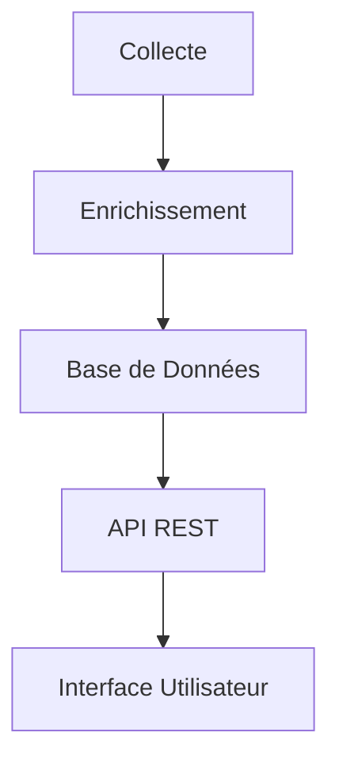

# Architecture Technique

## Vue d'ensemble

L'application Darija est conçue comme une solution de traduction en temps réel entre le Français, l'Anglais et le Darija (Arabe Marocain). L'architecture est modulaire et extensible, permettant une intégration facile de nouvelles fonctionnalités.

## Composants Principaux

### 1. Collecte de Données

- **Scraping** (`source/traductordarija_scrapping/`)
  - Récupération de traductions depuis diverses sources
  - Nettoyage et normalisation des données
  - Sauvegarde en format JSON

- **Dataset Darija-SFT-Mixture** (`source/data_Darija-SFT-Mixture/`)
  - Modules de traitement des données
  - Statistiques et analyses
  - Conversion de formats (Parquet, CSV)

### 2. Enrichissement des Données

- **Génération de Questions** (`source/agregation/generer_questions.py`)
  - Création de questions touristiques
  - Structuration des données
  - Export en format Excel

- **Enrichissement des Traductions** (`source/agregation/enrichir_traductions.py`)
  - Ajout de tags et contexte
  - Utilisation de GPT-4 pour l'enrichissement
  - Gestion des paires inversées pour la traduction bidirectionnelle

### 3. Base de Données

Structure SQL pour stocker les traductions :

```sql
CREATE TABLE translations (
    id SERIAL PRIMARY KEY,
    source_text TEXT NOT NULL,
    target_text TEXT NOT NULL,
    source_language VARCHAR(10) NOT NULL,
    target_language VARCHAR(10) NOT NULL,
    tags JSONB,
    context TEXT,
    created_at TIMESTAMP DEFAULT CURRENT_TIMESTAMP,
    updated_at TIMESTAMP DEFAULT CURRENT_TIMESTAMP
);

CREATE TABLE tags (
    id SERIAL PRIMARY KEY,
    name VARCHAR(50) NOT NULL UNIQUE,
    description TEXT
);

CREATE TABLE translation_tags (
    translation_id INTEGER REFERENCES translations(id),
    tag_id INTEGER REFERENCES tags(id),
    PRIMARY KEY (translation_id, tag_id)
);
```

### 4. API REST

Endpoints principaux :

- `GET /translations` : Liste des traductions
- `POST /translations` : Ajout d'une nouvelle traduction
- `GET /translations/{id}` : Détails d'une traduction
- `GET /translations/search` : Recherche de traductions
- `GET /tags` : Liste des tags
- `POST /tags` : Ajout d'un nouveau tag

### 5. Sécurité

- Authentification JWT
- Validation des données
- Protection contre les injections SQL
- Conformité RGPD

## Flux de Données



## Technologies Utilisées

- **Backend** : Python, FastAPI
- **Base de données** : PostgreSQL
- **Traitement du langage** : GPT-4
- **Gestion des dépendances** : pip
- **Versioning** : Git

## Évolutions Futures

1. Intégration d'un système de cache
2. Ajout de statistiques d'utilisation
3. Support de nouveaux dialectes
4. Amélioration de la qualité des traductions
5. Interface utilisateur web/mobile 