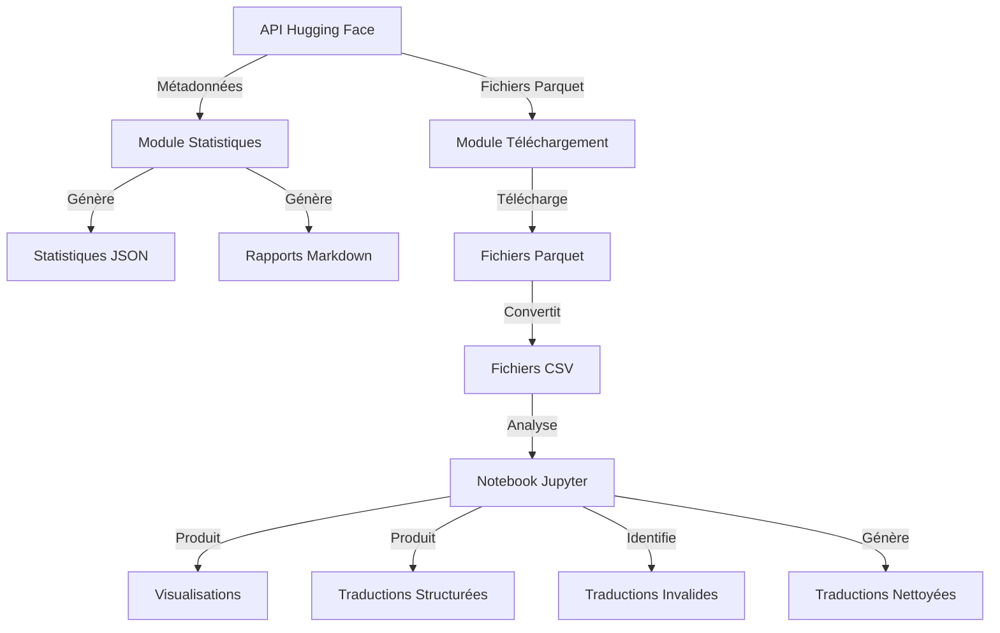

# Architecture du Projet Darija App

## Schéma d'Architecture

```
┌─────────────────────────────────────────────────────────────────────┐
│                        Pipeline d'Automatisation                     │
└───────────────────────────────────┬─────────────────────────────────┘
                                    │
                                    ▼
┌─────────────────────────┐    ┌────────────┐    ┌─────────────────────┐
│  API Hugging Face        │◄───┤ Statistiques├───►  Rapports Markdown  │
│  (Darija-SFT-Mixture)    │    │  du Dataset │    │  et JSON            │
└───────────┬─────────────┘    └────────────┘    └─────────────────────┘
            │
            ▼
┌─────────────────────────┐    ┌────────────┐    ┌─────────────────────┐
│  Téléchargement         │────► Conversion  ├───►  Fichiers CSV        │
│  des fichiers Parquet   │    │ en CSV      │    │  pour analyse       │
└─────────────────────────┘    └────────────┘    └──────────┬──────────┘
                                                            │
                                                            ▼
                                                 ┌─────────────────────┐
                                                 │  Analyse via        │
                                                 │  Jupyter Notebook   │
                                                 └──────────┬──────────┘
                                                            │
                                                            ▼
                                                 ┌─────────────────────┐
                                                 │  Résultats et       │
                                                 │  Visualisations     │
                                                 └─────────────────────┘
```

## Flux de Données



## Composants Principaux

### 1. Module de Statistiques (`dataset_statistics.py`)

```
┌─────────────────────────────────────────────────────────────┐
│ DarijaStatsAPI                                              │
├─────────────────────────────────────────────────────────────┤
│ - token: str                                                │
│ - dataset_id: str                                           │
│ - api_url: str                                              │
│ - headers: dict                                             │
│ - stats_dir: Path                                           │
│ - logger: Logger                                            │
├─────────────────────────────────────────────────────────────┤
│ + get_dataset_info(): dict                                  │
│ + prepare_stats(info: dict): dict                           │
│ + create_report(stats: dict): str                           │
│ + save_results(stats: dict, report: str): bool              │
│ + run(): bool                                               │
└─────────────────────────────────────────────────────────────┘
```

### 2. Module de Téléchargement (`parquet_downloader.py`)

```
┌─────────────────────────────────────────────────────────────┐
│ DarijaParquetDownloader                                     │
├─────────────────────────────────────────────────────────────┤
│ - token: str                                                │
│ - dataset_id: str                                           │
│ - parquet_dir: Path                                         │
│ - csv_dir: Path                                             │
│ - logger: Logger                                            │
├─────────────────────────────────────────────────────────────┤
│ + download_parquet(file_path: str): Path                    │
│ + convert_to_csv(parquet_path: Path): Path                  │
│ + process_file(file_path: str): bool                        │
│ + run(): bool                                               │
└─────────────────────────────────────────────────────────────┘
```

### 3. Module d'Automatisation (`pipeline_automatisation.py`)

```
┌─────────────────────────────────────────────────────────────┐
│ DarijaPipeline                                              │
├─────────────────────────────────────────────────────────────┤
│ - paths: dict                                               │
│ - logger: Logger                                            │
├─────────────────────────────────────────────────────────────┤
│ + execute_module(name: str, module: object): bool           │
│ + run(): bool                                               │
└─────────────────────────────────────────────────────────────┘
```

## Structure des Données

### Format des Données Darija-SFT-Mixture

```json
{
  "dataset": "nom_du_dataset",
  "id": "identifiant_unique",
  "messages": [
    {
      "content": "texte_du_message",
      "role": "user|assistant"
    },
    ...
  ],
  "direction": "direction_de_traduction",
  "metadata": { ... }
}
```

## Cycle de Vie des Données

1. **Extraction** : Téléchargement depuis l'API Hugging Face
2. **Transformation** : Conversion de Parquet vers CSV
3. **Analyse** : Traitement dans le notebook Jupyter
4. **Structuration** : Organisation des traductions
5. **Validation** : Identification des traductions invalides
6. **Nettoyage** : Production de traductions propres
7. **Visualisation** : Génération de graphiques et statistiques

## Dépendances Techniques

- **Python** : Langage principal
- **pandas** : Manipulation des données
- **huggingface_hub** : Accès à l'API Hugging Face
- **matplotlib/seaborn** : Visualisation des données
- **pyarrow** : Traitement des fichiers Parquet
- **Jupyter** : Environnement d'analyse interactif 